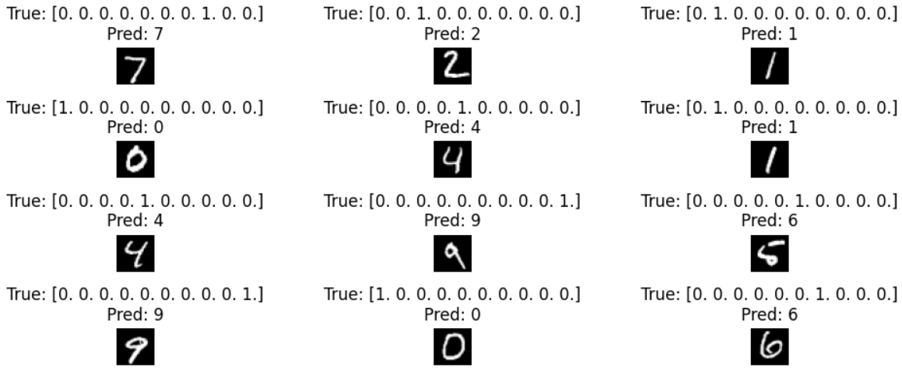

#  Neural Playground: Exploring Shallow Neural Networks with Keras

This project explores the behavior of shallow neural networks using the **Keras** library and the **MNIST** dataset. It complements an interactive lab task involving experimentation with different neural network configurations on [TensorFlow Playground](https://playground.tensorflow.org).

We investigate how the network architecture, activation functions, number of layers, and neurons influence model performance. The implementation provides tools for training, evaluation, and visualization.

---

##  Features

- Preprocessing and normalization of MNIST image data  
- One-hot encoding of categorical labels  
- Construction of a sequential neural network with:
  - Two hidden layers
  - ReLU activation functions
  - Softmax classifier for digit recognition
- Training using Adam optimizer and categorical crossentropy loss  
- Evaluation using test accuracy and a confusion matrix  
- Visualization of predictions

---

##  Dataset

- **MNIST Handwritten Digits Dataset**
  - 60,000 training samples
  - 10,000 testing samples
  - Image size: 28x28 pixels (grayscale)
  - 10 classes (digits 0–9)

##  Screen shoots

### Predyction results


### Confusion matrix
1[confusion matrix](images/confusionmatrix.png)

---

##  Installation

```bash
git clone https://github.com/your-username/neural-playground-keras.git
cd neural-playground-keras
